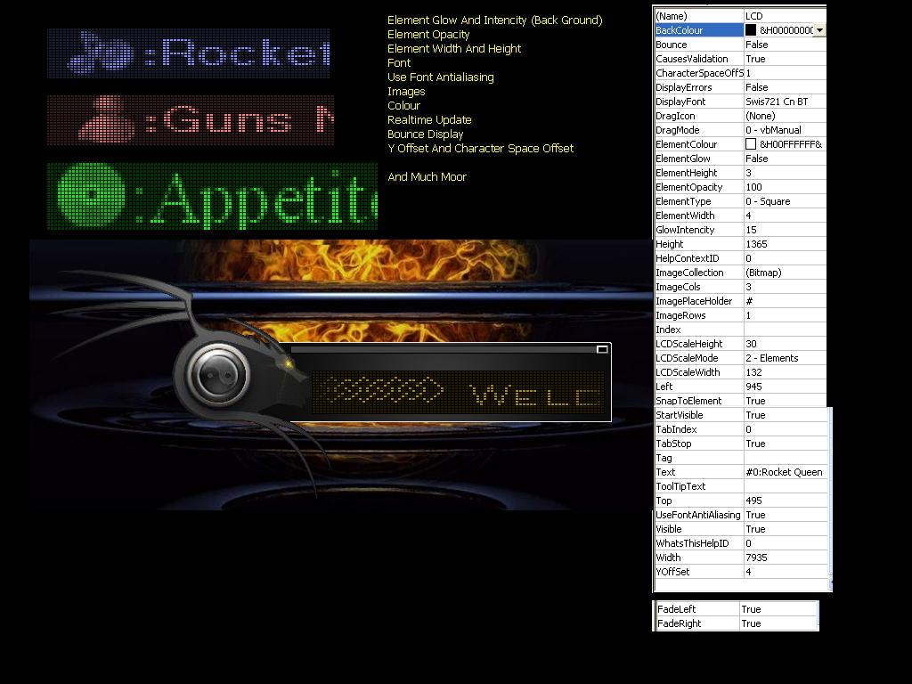



## LCD \\ LED Display Control 100%

### Description

**WITH MISSING CONTROLS** Control Now Supports Fade In Left\Right. As requested the control now also handles images. This control has been completely Re-Written. Tonns of new properties and function to manipulate the output of the display. Fonts now can use there antialiasing to give smoother looking text, it works tonns faster, element dimension can be resized. pictures can be inserted useing my own make of a picclip allowing you to update the text with as many images as you want in real time. Images can all be stored in one picture file. You can now view the results of your settings in design time. Take a peak, don't just look at it, fiddle with the properties and what not.

FIXED BUGS:1. Bounce Of Strings Smaller Then The Display 2. Loading Of Large Images (GetImagesWidth Function) 3. Image Place Holder Not Read At End Of String.
 
### More Info
 

             |
---                |---
**Submitted On**   |2007-01-30 20:45:12
**By**             |[Steven Atkiss](https://github.com/Planet-Source-Code/PSCIndex/blob/master/ByAuthor/steven-atkiss.md)
**Level**          |Intermediate
**User Rating**    |5.0 (130 globes from 26 users)
**Compatibility**  |VB 5\.0, VB 6\.0
**Category**       |[Custom Controls/ Forms/  Menus](https://github.com/Planet-Source-Code/PSCIndex/blob/master/ByCategory/custom-controls-forms-menus__1-4.md)
**World**          |[Visual Basic](https://github.com/Planet-Source-Code/PSCIndex/blob/master/ByWorld/visual-basic.md)
**Archive File**   |[LCD\_Displa2045461302007\.zip](https://github.com/Planet-Source-Code/steven-atkiss-lcd-led-display-control-100__1-67515/archive/master.zip)

